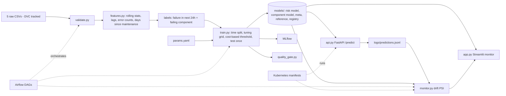
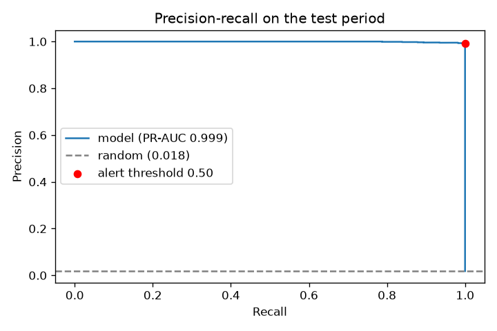

# Predictive Maintenance for Industrial Equipment - end-to-end ML + MLOps

[](../../actions/workflows/ci.yml) **API docs:** `/docs` | **Results:** [`reports/RESULTS.md`](reports/RESULTS.md)

Predict whether a machine will **fail within the next 24 hours** from its hourly sensor readings, error log and
maintenance history; say **which component** is likely to fail and **why**; show a monitoring view that raises
alerts; put a **cost** on every alerting policy; serve it via an API, **monitor drift**, and ship it with
**CI/CD, Docker, MLflow, DVC, Airflow and Kubernetes** definitions.

Data: [Microsoft Azure Predictive Maintenance](https://www.kaggle.com/datasets/arnabbiswas1/microsoft-azure-predictive-maintenance)
- 100 machines, one year of hourly telemetry (voltage, rotation, pressure, vibration), errors, component
replacements, failures, machine model and age.



## How each step of the brief is done

| Step | What this project does | Where |
|---|---|---|
| 1. Timestamped sensor data | Hourly telemetry per machine + errors + maintenance + machine age; checked for gaps, duplicates, bad values before training | `validate.py` |
| 2. Rolling + lag features, no future leakage | 3h and 24h mean/std per sensor, 24h trend (today's average minus yesterday's), error counts in the last 24h, days since each component was replaced. Every window ends at the current hour. A test corrupts all future readings and checks that past features do not change | `features.py`, `tests/test_features.py` |
| 3. Failure window + labels | `label = 1` if the machine fails in the next 24h (strictly after the row). The last 24h of data cannot be labelled and is dropped | `features.add_labels` |
| 4. Models + rare failures | Logistic Regression and a small Gradient Boosting grid, all with `class_weight="balanced"` (about 2% of rows are positive). Split is **by time**, with a 24h gap between train / validation / test so label windows never overlap | `train.py` |
| 5. Recall, precision, PR-AUC, false alarms | Per row and per event: failures caught, warning lead time, false-alarm days per week, PR-AUC with a machine-level bootstrap interval. Compared with a simple rule (alert on any error in the last 24h) | `evaluate.py` |
| 6. Monitoring view + alerts | Dashboard replays the test period: fleet table sorted by risk, ALERT / WATCH / OK, alert banner with likely component and reasons, alert log, per-machine history | `app.py` |

## Beyond the brief

| Level | Feature | Where |
|---|---|---|
| ML | **Which component will fail** - second model trained on warning rows, compared with the "most overdue component" rule | `train.py` |
| ML | **Why is this machine flagged** - occlusion reasons in plain language ("error2 logged 2x in the last 24h") | `explain.py` |
| ML | **Cost of each policy** - run-to-failure vs simple rule vs model, break-even inspection cost; alert threshold chosen by cost on validation | `policy.py`, `params.yaml` |
| ML | Bootstrap confidence interval (resampling machines), leakage + ablation + warning-window study | `evaluate.py`, `sanity_check.py` |
| Ops | MLflow tracking, model registry with versions, quality gate | `train.py`, `scripts/quality_gate.py` |
| Ops | Drift monitoring (PSI) on logged API traffic, scheduled workflow that opens an issue on ALERT | `monitor.py`, `.github/workflows/monitor.yml` |
| Ops | CI (lint, tests, k8s schema, Airflow DAG, docker build), CD to GHCR on a tag, Docker + compose | `.github/`, `Dockerfile` |
| Infra | DVC pipeline, Airflow DAGs, Kubernetes manifests (API, dashboard, HPA, drift CronJob) | `dvc.yaml`, `airflow/`, `k8s/` |

## Quick start

```
pip install -r requirements.txt                 # + requirements-extras.txt for mlflow and dvc
# put the 5 PdM_*.csv files from Kaggle in data/
python validate.py
python train.py                                 # a few minutes; also refreshes the Results section below
python sanity_check.py                          # leakage / ablation / warning-window check
streamlit run app.py                            # monitoring dashboard
uvicorn api:app --reload                        # API docs at http://localhost:8000/docs
python monitor.py --simulate                    # drift demo -> ALERT, shows up in the dashboard's Drift tab
mlflow ui --backend-store-uri sqlite:///mlflow.db
python -m pytest -q                             # tests (pip install -r requirements-dev.txt)
```

No Kaggle access? `python scripts/make_synthetic_data.py` writes **synthetic** files with the same columns, for
testing only. Never report numbers from them (the dashboard and results file show a warning, and the README is
never updated from a synthetic run).

## Results

<!-- RESULTS:START -->
Test period = the last ~20% of the timeline, never seen during training or threshold selection.
Model version `20261003-050220`. Full tables: [`reports/RESULTS.md`](reports/RESULTS.md).

| Metric (test period) | Value |
|---|---|
| Selected model | Gradient Boosting (lr=0.1, leaves=15) |
| PR-AUC | 0.9993, 95% CI [0.9976, 1.0000] (random guessing = 0.018) |
| Recall / Precision at the alert threshold (0.50) | 100.0% / 99.2% |
| Failures caught | 133 of 133, median warning 24h ahead |
| False-alarm days | 0.4 per week across 100 machines |
| Which component will fail (top-1) | 100.0% of 1054 warning rows (most-overdue-component rule: 51.1%) |

**Cost of each policy over the test period** (ASSUMED: breakdown 10,000, planned repair
2,500, inspection after a false alarm 500):

| Policy | Caught | Missed | False-alarm days | Cost | Saving vs run-to-failure |
|---|---|---|---|---|---|
| Run to failure (no alerts) | 0 | 133 | 0 | 1,330,000 | 0 (0%) |
| Rule: alert on any error in last 24h | 133 | 0 | 979 | 822,000 | 508,000 (38%) |
| Model (threshold 0.50) | 133 | 0 | 4 | 334,500 | 995,500 (75%) |

The model's alerts stay worthwhile until one false-alarm inspection costs more than 249,375.
Model saving: **995,500** (75%).


<!-- RESULTS:END -->

### Is a score this high real? (`python sanity_check.py`)

Near-perfect scores usually mean leakage, so the pipeline is checked directly:

<!-- SANITY:START -->
Test PR-AUC, 24h window. Random guessing = 0.0182.

| Trained on | Test PR-AUC |
|---|---|
| All features | 0.9984 |
| Error counts only | 0.6861 |
| Maintenance history only | 0.2988 |
| Sensors only (raw, rolling, trend) | 0.2665 |
| Machine age + model only | 0.0243 |
| All features, **shuffled** training labels | 0.0145 |

Same pipeline with a shorter or longer warning window:

| Warning window | Positive rows | Test PR-AUC |
|---|---|---|
| 12h | 0.90% | 0.9633 |
| 24h | 1.82% | 0.9984 |
| 48h | 3.61% | 0.9606 |
| 72h | 5.40% | 0.8125 |
<!-- SANITY:END -->

- With shuffled labels the score falls to the random level, and a unit test confirms that corrupting future
  readings does not change past features. So the score is not coming from the future or from the split.
- No single feature group gets close to the full model. It needs errors, component age and sensor drift **together**.
- The honest reading: this dataset is widely understood to be simulated, and its failures are preceded by clean
  error and sensor patterns. Real factory data would be noisier and the score lower. The method (time split,
  leakage test, event-level metrics, sanity check) is what carries over, not the number.

## Decisions worth knowing

- **Time split, not random split.** Neighbouring hours are almost identical, so a random split would put near-copies
  of test rows in training and inflate every metric.
- **Threshold is chosen by cost on validation.** Each caught failure becomes a planned repair, each miss a
  breakdown, each false-alarm day an inspection. Set `threshold_by: fbeta` in `params.yaml` for the F2 alternative.
- **Costs are assumptions.** The dataset has no cost data. The savings table moves with `costs` in `params.yaml`;
  the break-even inspection cost shows how wrong the assumption can be before alerts stop paying.
- **Risk score, not a calibrated probability.** Class weights push scores up; treat it as a ranking with a threshold.
- **False alarms are counted strictly.** An alert 30 hours before a failure is counted as false, although in practice
  it is still useful.
- **Reasons are occlusion-based.** A reason is "resetting this group of features to the healthy median lowers the
  risk by X". It describes the model, not the physics of the machine.

## API

```
POST /predict   one machine's recent history (>= 48 hourly readings, optional errors and maintenance events)
             -> risk_score, alert, status, likely_component, reasons
GET  /health
```

Features are built by the same `build_features` function used in training, so serving and training cannot drift
apart. Every scored row is appended to `logs/predictions.jsonl`, which is what the drift monitor reads.

## Monitoring

```
python monitor.py --simulate                         # demo: drifted sensors -> ALERT (exit code 1)
python monitor.py --current logs/predictions.jsonl   # real API traffic vs the training reference (PSI)
python scripts/quality_gate.py                       # exit 1 if the new model is below the floor or dropped
```

Scheduled version: `.github/workflows/monitor.yml` checks `monitoring/current.csv` daily and opens an issue on ALERT.

## Pipeline and deployment tooling (what is built, what is not)

- **DVC:** first delete the `data/` line from `.gitignore`, then `dvc init`, `dvc add data/PdM_telemetry.csv` (and the
  other four files), `dvc remote add -d storage ../dvc-storage`, `dvc repro`, `dvc push`. Change `params.yaml` ->
  `dvc repro` -> `dvc metrics diff`.
- **Airflow:** `airflow/dags/pdm_pipeline.py` - weekly validate -> train -> gate, daily drift check. Compiles in CI.
  Needs WSL2/Docker on Windows.
- **Kubernetes:** `docker build --target baked -t pdm-api:1.0 .`, then `kubectl apply -k k8s/` (kind/minikube).
  Manifests pass schema validation in CI; not operated on a production cluster.
- **Docker:** `docker compose up --build` -> API on :8000, dashboard on :8501 (`models/` mounted).
- **CD:** `git tag v1.0.0 && git push --tags` -> image on `ghcr.io/<username>/predictive-maintenance`.

## Limitations

- One year of data from one fleet, widely understood to be simulated; the test period is the last ~10 weeks.
- Costs are assumed, so savings are illustrative.
- Assumes hourly telemetry with no gaps (enforced by validation and by the API).
- The dashboard replays historical test data; it is not connected to a live sensor feed.
- Airflow / Kubernetes / DVC remote are demo-grade here (validated, not run in production).

## Structure

```
config.py features.py validate.py evaluate.py policy.py explain.py report.py train.py sanity_check.py
monitor.py api.py app.py params.yaml dvc.yaml
scripts/{make_synthetic_data,quality_gate}.py   tests/   airflow/dags/   k8s/   monitoring/   docs/
Dockerfile docker-compose.yml   .github/workflows/{ci,cd,monitor}.yml   requirements*.txt   pyproject.toml
```

## Future scope

- **Remaining useful life:** predict how many hours are left instead of a yes/no for the next 24h.
- **Real, noisy data:** run the same pipeline on NASA turbofan or Backblaze drive data, since this dataset is simulated.
- **Live sensor stream:** the dashboard replays history; connect it to real-time readings (Kafka or MQTT).
- **Feedback loop:** let technicians mark alerts as right or wrong, and retrain automatically when drift reaches ALERT.
- **Real cost data:** replace the assumed costs with actual repair and downtime figures.
