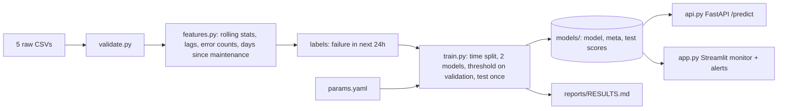

# Predictive Maintenance for Industrial Equipment

[](../../actions/workflows/ci.yml)

Predict whether a machine will **fail within the next 24 hours** from its hourly sensor readings, error log and
maintenance history, and show a monitoring view that raises alerts for high-risk machines.

Data: [Microsoft Azure Predictive Maintenance](https://www.kaggle.com/datasets/arnabbiswas1/microsoft-azure-predictive-maintenance)
- 100 machines, one year of hourly telemetry (voltage, rotation, pressure, vibration), errors, component
replacements, failures, machine model and age.



## How each step of the brief is done

| Step | What this project does | Where |
|---|---|---|
| 1. Timestamped sensor data | Hourly telemetry per machine + errors + maintenance + machine age; checked for gaps, duplicates, bad values before training | `validate.py` |
| 2. Rolling + lag features, no future leakage | 3h and 24h mean/std per sensor, 24h trend (today's average minus yesterday's), error counts in the last 24h, days since each component was replaced. Every window ends at the current hour. A test corrupts all future readings and checks that past features do not change | `features.py`, `tests/test_features.py` |
| 3. Failure window + labels | `label = 1` if the machine fails in the next 24h (strictly after the row). The last 24h of data cannot be labelled and is dropped | `features.add_labels` |
| 4. Models + rare failures | Logistic Regression and Gradient Boosting, both with `class_weight="balanced"` (about 2% of rows are positive). Split is **by time**, with a 24h gap between train / validation / test so label windows never overlap | `train.py` |
| 5. Recall, precision, PR-AUC, false alarms | Reported per row and per event: failures caught (at least one alert in the warning window) and false-alarm days per week. Compared with a simple rule: alert on any error in the last 24h | `evaluate.py`, `reports/RESULTS.md` |
| 6. Monitoring view + alerts | Dashboard replays the test period: fleet table sorted by risk, ALERT / WATCH / OK status, alert banner, per-machine risk and sensor history | `app.py` |

## Quick start

```
pip install -r requirements.txt
# put the 5 PdM_*.csv files from Kaggle in data/
python validate.py
python train.py                 # about 1-2 minutes
streamlit run app.py            # monitoring dashboard
uvicorn api:app --reload        # API docs at http://localhost:8000/docs
python -m pytest -q             # tests (pip install -r requirements-dev.txt)
```

No Kaggle access? `python scripts/make_synthetic_data.py` writes **synthetic** files with the same columns, for
testing only. Never report numbers from them (the dashboard and results file show a warning).

## Decisions worth knowing

- **Time split, not random split.** Neighbouring hours are almost identical, so a random split would put near-copies
  of test rows in training and inflate every metric.
- **Threshold is chosen on validation by F2.** A missed failure costs more than an unnecessary inspection, so recall
  is weighted higher. Change `fbeta` in `params.yaml` to move the trade-off.
- **Risk score, not a calibrated probability.** Class weights push scores up; treat it as a ranking with a threshold.
- **False alarms are counted strictly.** An alert 30 hours before a failure is counted as false, although in practice
  it is still useful.

## API

`POST /predict` takes one machine's recent history (at least 48 hourly readings, plus optional errors and
maintenance events) and returns `risk_score`, `alert`, `status`. Features are built by the same `build_features`
function used in training, so serving and training cannot drift apart. Try it from `/docs`.

## Results

Generated by `python train.py` into [`reports/RESULTS.md`](reports/RESULTS.md) (metrics table, model comparison,
top features, PR curve).

## Limitations

- One year of data from one fleet; the test period is the last ~10 weeks.
- Predicts *that* a machine will fail, not *which component*.
- Assumes hourly telemetry with no gaps (enforced by validation and by the API).
- The dashboard replays historical test data; it is not connected to a live sensor feed.

## Structure

```
config.py features.py validate.py evaluate.py train.py api.py app.py params.yaml
scripts/make_synthetic_data.py   tests/   .github/workflows/ci.yml   requirements*.txt
```
